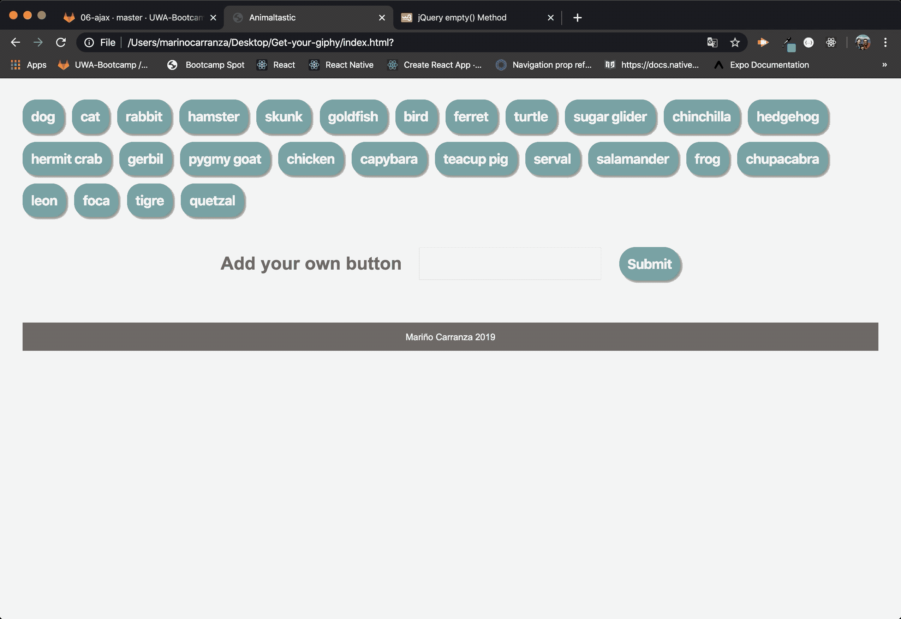

# **Get Your Giphy**

# **Description**
Twenty-six on load buttons to retrieve the top ten giphies from giphy.com
User has the opportunity to add buttons of their own to look for ther personal choices.

## **Usage**
After clicking on any given button the app will make a call to the giphy.com api, retrieve the top ten results and display them to the page for the user to enjoy.

## **Technologies Used**
•  HTML

•  CSS  

•  JavaScript

•  JQuery

•  Ajax

•  GitHub pages

## **Support**
Feel free to contact me marino.carranza@gmail.com with any questions, suggestions or feedback you may have.

## **Rodamap**
I do not have any clear ideas about where to go with this app from here, the only think I can think of is that is would be fun to re-work it so it can be tailored to a specific person to be able to retrieve their favorites gifs, it would make a nice pick me up on a gloomy day.

## **Visuals**

## **Acknowledgments**
I would like to thank Catherine Pham and Arron Linton for their support and guidance.